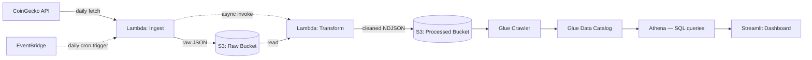

# Serverless Crypto Market Data Pipeline

An end-to-end serverless ETL pipeline on AWS that ingests real-time cryptocurrency market data daily, transforms it into a queryable format, and visualizes it in an interactive dashboard — built to explore serverless data engineering patterns using entirely managed AWS services (no servers to provision or maintain).

## Architecture



**Flow:** EventBridge triggers the ingest Lambda every day, which pulls market data for 50 coins from the CoinGecko API and writes raw JSON to S3, partitioned by date. It then asynchronously invokes the transform Lambda, which reads the latest raw file, cleans and flattens it into newline-delimited JSON, and writes it to a separate processed bucket — also partitioned by date. A Glue Crawler catalogs the processed data's schema, making it queryable through Athena via standard SQL. The Streamlit dashboard runs live Athena queries and renders the results as interactive charts.

## Tech stack

- **Compute:** AWS Lambda (Python 3.12)
- **Storage:** Amazon S3 (raw + processed data lake, date-partitioned)
- **Orchestration:** Amazon EventBridge (scheduled trigger)
- **Cataloging & query:** AWS Glue, Amazon Athena
- **IAM:** Least-privilege execution roles scoped per function
- **Visualization:** Streamlit, Plotly
- **Data source:** [CoinGecko API](https://www.coingecko.com/en/api)

## Dashboard


The dashboard surfaces total tracked market cap, top gainers/losers, a market-cap treemap colored by 24-hour performance, and a volume-vs-market-cap comparison — all queried live from S3 via Athena.

## Setup and running locally

**Prerequisites:** Python 3.10+, an AWS account with configured CLI credentials, a free [CoinGecko Demo API key](https://www.coingecko.com/en/api/pricing).

```bash
# Clone and set up environment
git clone https://github.com/dtkauber/crypto-pipeline.git
cd crypto-pipeline
python3 -m venv venv
source venv/Scripts/activate   # or source venv/bin/activate on Mac/Linux
pip install -r requirements.txt
```

Create a `.env` file (see `.env.example`) with your CoinGecko key:

```
COINGECKO_API_KEY=your_key_here
```

**Run the fetch script locally:**

```bash
python src/fetch_data.py
```

**Run the dashboard:**

```bash
python -m streamlit run src/dashboard/app.py
```

The Lambda functions, EventBridge schedule, Glue crawler, and Athena workgroup are deployed directly to AWS via the CLI (see `/src/lambda_ingest` and `/src/lambda_transform` for the function code). Deployment commands are documented inline in each handler's module docstring.

## Design decisions

A few choices worth calling out, since they reflect real data engineering trade-offs rather than defaults:

- **Date-partitioned S3 keys** (`date=YYYY-MM-DD/...`) — lets Athena prune partitions instead of scanning the entire bucket, which matters for cost and query speed as data accumulates.
- **Newline-delimited JSON (NDJSON)** for processed data — the format Athena expects for row-by-row querying, rather than a single JSON array.
- **Asynchronous Lambda chaining** (`InvocationType="Event"`) — the ingest function triggers the transform function without waiting on it, keeping each stage independent and avoiding a single long-running function.
- **Least-privilege IAM policies** — each Lambda's execution role grants only the specific S3 actions it needs (e.g., the ingest function can `PutObject` to the raw bucket only; it cannot read the processed bucket).
- **Environment-variable configuration** — bucket names and API keys are injected via Lambda environment variables rather than hardcoded, keeping the code portable across environments.

## Future improvements

- **Infrastructure as Code** — migrate the CLI-provisioned resources (Lambda, IAM roles, EventBridge rule, Glue crawler) to Terraform or AWS SAM for reproducible, version-controlled deployments.
- **Historical trend analysis** — accumulate enough daily snapshots to support time-series queries (e.g., 30-day price trends) rather than latest-snapshot-only views.
- **Data quality checks** — add validation in the transform step to catch malformed or missing fields before they reach the processed bucket.
- **CI/CD** — automate Lambda deployment via GitHub Actions on push to `main`.

## Author

Daniel Kauber — [GitHub](https://github.com/dtkauber) · [LinkedIn](https://www.linkedin.com/in/daniel-kauber)
